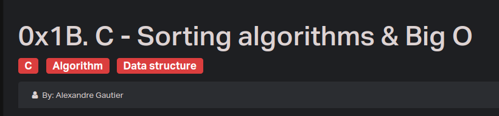

## 0. Bubble sort - compare two adjacents integers and swaps them if not in order
## 1. Insertion sort - builds the final sorted array (or list) one item at a time by comparisons
## 2. Selection sort - builds a sorted sublist by selecting the minimum item and swapping it.